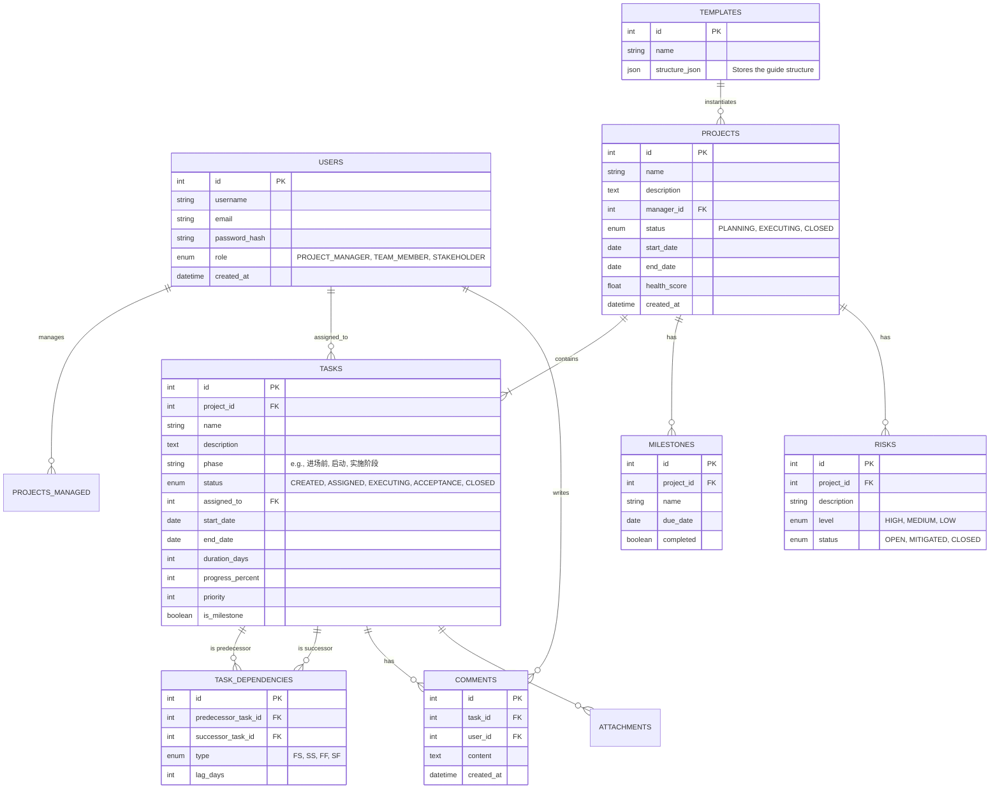

# 数据库设计文档 (Database Design Document)

## 1. 概述
本项目管理系统旨在支持全过程项目管理，核心实体包括用户、项目、任务、甘特图依赖、协作记录等。设计遵循第三范式，确保数据一致性与扩展性。

## 2. ER图 (Mermaid)

## 3. 表结构详细说明

### 3.1 Users (用户表)
| 字段名 | 类型 | 说明 |
|---|---|---|
| id | INT | 主键 |
| username | VARCHAR(50) | 用户名 |
| role | ENUM | 角色：项目经理、团队成员、干系人 |

### 3.2 Projects (项目表)
| 字段名 | 类型 | 说明 |
|---|---|---|
| id | INT | 主键 |
| manager_id | INT | 外键，关联Users |
| health_score | FLOAT | 项目健康度 (0-100) |

### 3.3 Tasks (任务表)
核心表，支持甘特图和生命周期管理。
| 字段名 | 类型 | 说明 |
|---|---|---|
| id | INT | 主键 |
| phase | VARCHAR(100) | 阶段（对应指南中的阶段划分） |
| status | ENUM | 状态：创建、分配、执行、验收、关闭 |
| progress_percent | INT | 进度 (0-100) |

### 3.4 Task_Dependencies (任务依赖表)
用于计算关键路径和绘制甘特图连线。
| 字段名 | 类型 | 说明 |
|---|---|---|
| predecessor_task_id | INT | 前置任务ID |
| successor_task_id | INT | 后置任务ID |
| type | ENUM | 依赖类型 (默认FS: Finish-to-Start) |

### 3.5 Risks (风险表)
用于仪表盘风险预警。

## 4. 索引策略
- 在 `tasks.project_id` 上建立索引以加速项目任务查询。
- 在 `task_dependencies` 的 `predecessor_task_id` 和 `successor_task_id` 上建立索引以加速甘特图计算。
